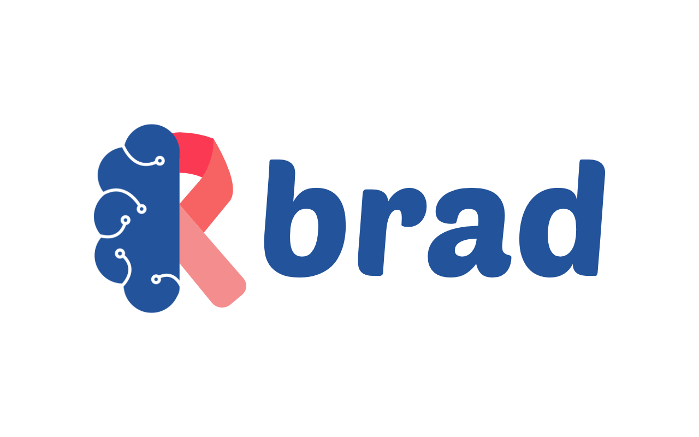

<h1>B.R.A.D - Breast-cancer Risk Analysis & Diagnostics</h1>

<h4>A machine learning application to classify breast cancer tumors as being benign or malignant.<h4>

## Inspiration

As breast cancer is such a pressing medical issue (even effecting one of the lives of the developers), we want to play our part in the fight against breast cancer.

## What it does

BRAD is an application used by doctors. Doctors can input results from an FNA procedure (fine needle aspiration) on a breast mass, and the system will classify the mass as being a benign or malignant tumor. 

## How we built it

BRAD is built as a full scale web application with a python back-end to do the heavy lifting.

## Challenges we ran into

As machine learning is such an involved and advanced field, optimizing many classification models to high accuracy for our purpose proved to be challenging. We made it a point to hold a high accuracy rating even at a low amount of inputs (i.e. not a feature-filled dataset).

## Accomplishments that we're proud of

We're very proud to have achieved a 96.5% +/-0.5% accuracy rating on classifying breast cancer tumors as being benign or malignant. Even without a feature-complete dataset (i.e. only with a fraction of the inputs), we can still hold an accuracy rating of above 90%. A case of 1/10th of the amount of optimal inputs was tested, and an accuracy of 95% was achieved.

## What we learned

We learned a great deal about artificial intelligence specifically in the machine learning domain. Not only did we expand on our technical competences, but we also learned a lot about breast cancer and things in the medical realm.

## What's next for B.R.A.D - Breast-cancer Risk Analysis & Diagnostics

As all of our data comes out of FNA procedures, we envision the capability of inputting a digitized image of an FNA observation, image processing over it to produce the wanted inputs, and predicting the classification. We'd like to work with doctors to take this data, correctly verify it, and add it to global datasets to assist with the ongoing fight against breast cancer. Continuously re-training and optimizing BRAD during this process will only lead to higher accuracy's. In terms of application plans, we'd like to implement better security into the application layer for better doctor/patient privacy. 

## To Run:

1. Open to BRAD folder
2. In terminal type: sh install_all.sh This will install all libraries for the python code.
3. To run the web, in terminal type: sh run_web.sh
